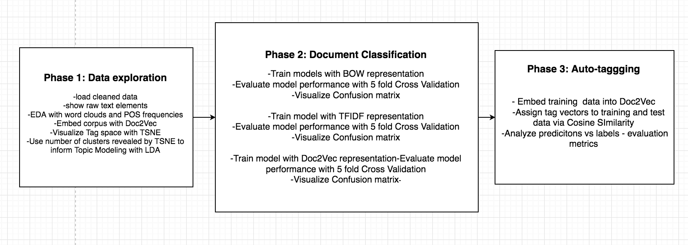
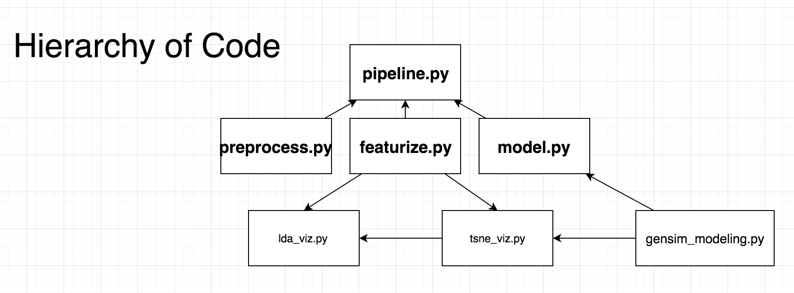

# Classification and Auto-Tagging of Stack Exchange Questions

In this project, I tested a suite of machine learning and NLP techniques to learn
patterns from Stack Overflow posts.

- Word Clouds and POS tag analysis.
- Document vectorization (bag of words, tfidf, word2vec)
- Manifold visualization with t-sne
- Document classification
  - Multinomial Naive Bayes
  - Random Forest (achieved an f1 score of 0.999848 on the holdout test set)
  - Logistic Regression
  - Support Vector Machines
  - Gradient Boosted Trees
  - AdaBoost
- Topic Modeling with LDA

**[Problem posed by Kaggle](https://www.kaggle.com/c/transfer-learning-on-stack-exchange-tags):** Predict tags from models trained on unrelated topics.

*"What does physics have in common with **_biology, cooking, cryptography, diy, robotics, and travel?_** If you answered "all pursuits are governed by the immutable laws of physics" we'll begrudgingly give you partial credit. If you answered "all were chosen randomly by a scheming Kaggle employee for a twisted transfer learning competition", congratulations, we accept your answer and mark the question as solved.*

*In this competition, we provide the titles, text, and tags of Stack Exchange questions from six different sites. We then ask for tag predictions on unseen physics questions. Solving this problem via a standard machine approach might involve training an algorithm on a corpus of related text. Here, you are challenged to train on material from outside the field. Can an algorithm learn appropriate physics tags from "extreme-tourism Antarctica"? Let's find out."*

## Breakdown of the project

## Read the notebooks in the following order:

1. EDA.ipynb
2. LDA.ipynb
3. Document_Classification.ipynb
4. Autotagging.ipynb

## How the modules in the code folder relate to each other.

